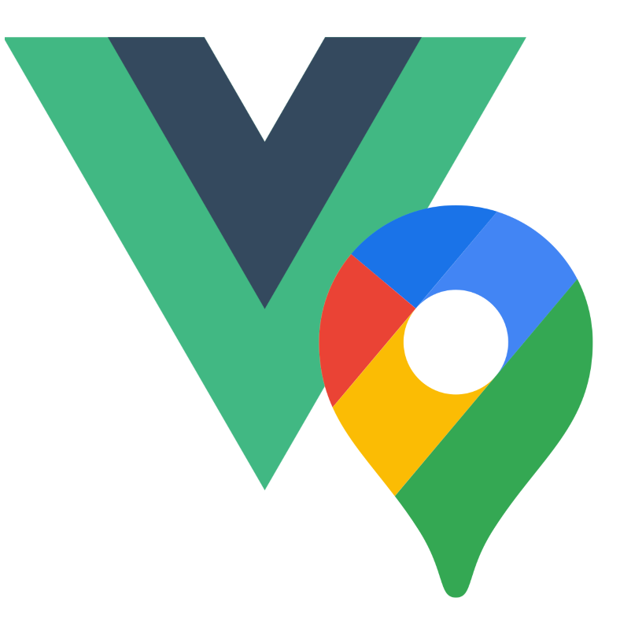

# v3-gmaps

<div style="text-align: center">
  
  <p>
    <a href="https://npmjs.com/package/v3-gmaps"></a>
    <a href="https://npmjs.com/package/v3-gmaps"></a>
    <a href="https://npmjs.com/package/v3-gmaps"></a>
  </p>
</div>

### This is a lightweight, fully typed library to simplify the use of [Google Maps](https://developers.google.com/maps/) in [Vue3](http://vuejs.org) 🤏🗺️🧩

### For the (original) Vue 2 version check out [x5-gmaps](https://xon52.github.io/x5-gmaps) 💪

<br/>

## Guide / Demo / Tutorials

- Docs: _Coming soon_
- Demo on [StackBlitz](https://vue-bujcvu.stackblitz.io)

<br/>

## Installation

```bash
# npm
npm install v3-gmaps
```

## Deployment

This plugin can be installed like any Vue plugin:

```js
import v3gmaps from 'v3-gmaps'
import { createApp } from 'vue'
import App from './App.vue'

// Optional stylesheet needed for showing errors and the Popup component
import 'v3-gmaps/dist/style.css';

createApp(App)
  .use(gmaps, { key: 'GOOGLE_API_KEY', libraries: ['visualization'] })
  .mount('#app')

```

## Usage

```html
<template>
  <div style="height: 500px"> <!-- gmaps-map requires a height to fill -->
    <gmaps-map>
      <gmaps-marker :position="{ lat: -27, lng: 153 }" />
    </gmaps-map>
  </div>
</template>

<script>
import { defineComponent } from 'vue'
import { gmapsMap, gmapsMarker } from 'v3-gmaps';

export default defineComponent({
  components: { gmapsMap, gmapsMarker }
});
</script>
```

<br/>

## License

This project is licensed under the MIT License - see the [LICENSE](LICENSE) file for details

## Authors

- [Keagan Chisnall](https://github.com/xon52)

## Support

<a href="https://www.buymeacoffee.com/chisnallio" target="_blank"></a>
