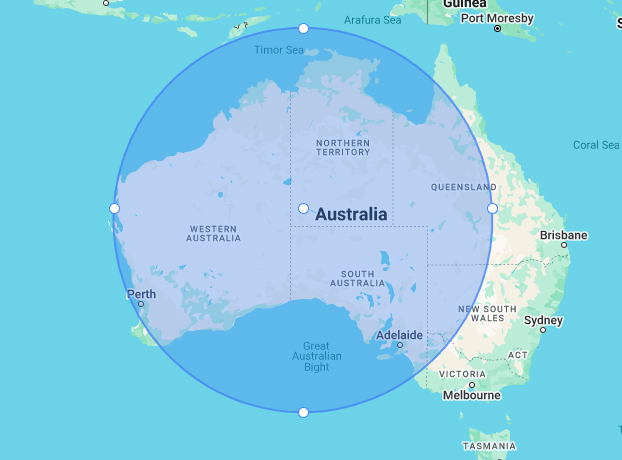

# Circle (`gm-circle`)

<br />

<div class="v3-gmaps-screenshot">
  
  <p>In addition to <a href="./polyline">polylines</a>, <a href="./polygon">polygons</a>, and <a href="./rectangle">rectangles</a> you can also create circles on a map.</p>
</div>

## Simple Use ([demo](https://vue-bujcvu.stackblitz.io/shapes))

```html
<template>
  <div style="height: 500px">
    <gm-map>
      <gm-circle :center="{ lat: -28, lng: 125 }" :radius="500000" />
    </gm-map>
  </div>
</template>

<script setup lang="ts">
import { gmMap, gmCircle } from 'v3-gmaps';
</script>
```

## Props

| Props     |            Type             | Default | Description                                                                                                                        |
| :-------- | :-------------------------: | :-----: | :--------------------------------------------------------------------------------------------------------------------------------- |
| center    |        `GmPosition`         |    -    | The center of the Circle.                                                                                                          |
| draggable |          `boolean`          | `false` | Whether this Circle can be dragged over the map.                                                                                   |
| editable  |          `boolean`          | `false` | Whether this Circle can be edited by dragging the control points shown at the center and around the circumference.                 |
| radius    |          `number`           |    -    | The radius in meters on the Earth's surface.                                                                                       |
| visible   |          `boolean`          | `true`  | Whether this Circle is visible on the map.                                                                                         |
| options   | `google.maps.CircleOptions` |    -    | [Google Maps CircleOptions interface](https://developers.google.com/maps/documentation/javascript/reference/polygon#CircleOptions) |

## Events

| Event          |         Type         | Description                                                                |
| :------------- | :------------------: | :------------------------------------------------------------------------- |
| center_changed |     `GmPosition`     | This event is fired when the circle's center is changed.                   |
| click          |     `GmPosition`     | This event is fired when the DOM click event is fired on the Circle.       |
| dblclick       |     `GmPosition`     | This event is fired when the DOM dblclick event is fired on the Circle.    |
| drag           |     `GmPosition`     | This event is repeatedly fired while the user drags the Circle.            |
| dragend        |     `GmPosition`     | This event is fired when the user stops dragging the Circle.               |
| dragstart      |     `GmPosition`     | This event is fired when the user starts dragging the Circle.              |
| mounted        | `google.maps.Circle` | On mounted the component will emit the Google Maps object it represents.   |
| mousedown      |     `GmPosition`     | This event is fired for a mousedown on the Circle.                         |
| mousemove      |     `GmPosition`     | This event is fired for a mousemove on the Circle.                         |
| mouseout       |     `GmPosition`     | This event is fired when the mouse leaves the area of the Circle.          |
| mouseover      |     `GmPosition`     | This event is fired when the mouse enters the area of the Circle.          |
| mouseup        |     `GmPosition`     | This event is fired for a mouseup on the Circle.                           |
| radius_changed |       `number`       | This event is fired when the circle's radius is changed.                   |
| rightclick     |     `GmPosition`     | This event is fired for a rightclick on the Circle.                        |
| unmounted      | `google.maps.Circle` | On unmounted the component will emit the Google Maps object it represents. |

## Notes

- The circle is geodesic which means it projects itself on the map as if it is on a globe. You can see these effects by dragging a circle far North or South.
