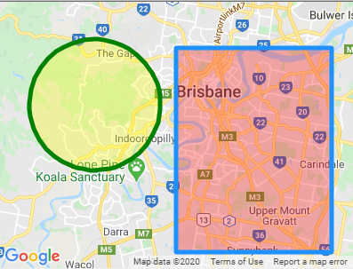

# Circle (`gmaps-circle`)

<div class="v3-gmaps-screenshot">
  
  <p>In addition to <a href="./polyline">polylines</a>, <a href="./polygon">polygons</a>, and <a href="./rectangle">rectangles</a> you can also create circles on a map.</p>
</div>

### Simple Use ([demo](https://vue-bujcvu.stackblitz.io/shapes))

```html
<template>
  <div style="height: 500px">
    <gmaps-map>
      <gmaps-circle :center="{ lat: -28, lng: 125 }" :radius="500000" />
    </gmaps-map>
  </div>
</template>

<script>
import { defineComponent } from 'vue';
import { gmapsMap, gmapsCircle } from 'v3-gmaps';

export default defineComponent({
  components: { gmapsMap, gmapsCircle },
});
</script>
```

### Props

| Props     |         Type         | Default | Description                                                                                                        |
| :-------- | :------------------: | :-----: | :----------------------------------------------------------------------------------------------------------------- |
| options\* | `GmapsCircleOptions` |    -    | Object used to define the properties of a `gmaps-circle`.                                                          |
| center    |   `GmapsPosition`    |    -    | The center of the Circle.                                                                                          |
| draggable |      `boolean`       | `false` | Whether this Circle can be dragged over the map.                                                                   |
| editable  |      `boolean`       | `false` | Whether this Circle can be edited by dragging the control points shown at the center and around the circumference. |
| radius    |       `number`       |    -    | The radius in meters on the Earth's surface.                                                                       |
| visible   |      `boolean`       | `true`  | Whether this Circle is visible on the map.                                                                         |

\* To see all of the possible options, have a look at the [Google Maps MarkerOptions interface](https://developers.google.com/maps/documentation/javascript/reference/map#MarkerOptions).

### Events

| Event          |         Type         | Description                                                                |
| :------------- | :------------------: | :------------------------------------------------------------------------- |
| center_changed |   `GmapsPosition`    | This event is fired when the circle's center is changed.                   |
| click          |   `GmapsPosition`    | This event is fired when the DOM click event is fired on the Circle.       |
| dblclick       |   `GmapsPosition`    | This event is fired when the DOM dblclick event is fired on the Circle.    |
| drag           |   `GmapsPosition`    | This event is repeatedly fired while the user drags the Circle.            |
| dragend        |   `GmapsPosition`    | This event is fired when the user stops dragging the Circle.               |
| dragstart      |   `GmapsPosition`    | This event is fired when the user starts dragging the Circle.              |
| mounted        | `google.maps.Circle` | On mounted the component will emit the Google Maps object it represents.   |
| mousedown      |   `GmapsPosition`    | This event is fired for a mousedown on the Circle.                         |
| mousemove      |   `GmapsPosition`    | This event is fired for a mousemove on the Circle.                         |
| mouseout       |   `GmapsPosition`    | This event is fired when the mouse leaves the area of the Circle.          |
| mouseover      |   `GmapsPosition`    | This event is fired when the mouse enters the area of the Circle.          |
| mouseup        |   `GmapsPosition`    | This event is fired for a mouseup on the Circle.                           |
| radius_changed |       `number`       | This event is fired when the circle's radius is changed.                   |
| rightclick     |   `GmapsPosition`    | This event is fired for a rightclick on the Circle.                        |
| unmounted      | `google.maps.Circle` | On unmounted the component will emit the Google Maps object it represents. |

### Notes

- `gmaps-circle` has most of the [properties and events Google Maps' Circle](https://developers.google.com/maps/documentation/javascript/reference/polygon#Circle) has.
- There is no `contextmenu` event for the circle 😢
- The circle is geodesic which means it projects itself on the map as if it is on a globe. You can see these effects by dragging a circle far North or South.
