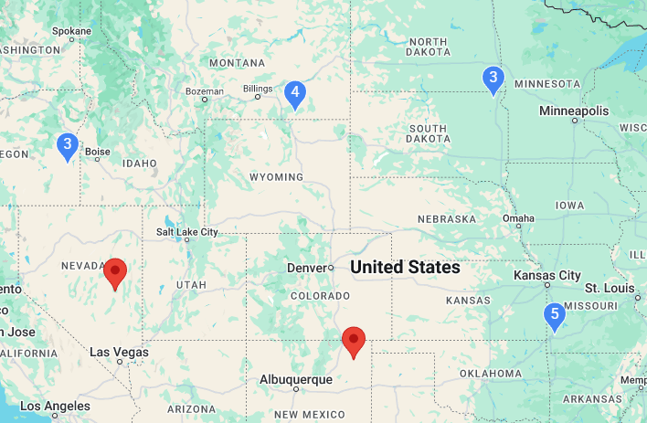

# Cluster (`gm-cluster`)

<div class="v3-gmaps-screenshot">
  
  <p>The Cluster is an alternative to the <a href="./heatmap">heatmap</a> when showing lots of data efficiently.</p>
</div>

### Simple Use ([demo](https://vue-bujcvu.stackblitz.io/cluster))

```html
<template>
  <div style="height: 500px">
    <gm-map>
      <gm-cluster :items="items" :max-zoom="16" />
    </gm-map>
  </div>
</template>

<script setup lang="ts">
import { gmMap, gmCluster, type GmClusterItem } from 'v3-gmaps';

const items: GmClusterItem[] = [
  { position: { lat: 37, lng: 56 } },
  { position: { lat: 15, lng: 108 } },
  // ...more items
];
</script>
```

### Props

| Props   |       Type        | Default | Description                                          |
| :------ | :---------------: | :-----: | :--------------------------------------------------- |
| items   | `GmClusterItem[]` |    -    | Items to be clustered on the map.                    |
| maxZoom |     `number`      |   16    | Maximum zoom level at which clusters can be created. |
| pin     |      `GmPin`      |    -    | Custom styling for cluster markers.                  |

### Cluster Items

A cluster item has the following properties:

```typescript
interface GmClusterItem {
  position: GmPosition;  // Required: {lat, lng} coordinates
  title?: string;        // Optional: tooltip text
  clickable?: boolean;   // Optional: whether the marker is clickable
  draggable?: boolean;   // Optional: whether the marker is draggable
  pin?: GmPin;           // Optional: custom marker appearance
  onClick?: (item: GmClusterItem) => void;  // Optional: click handler
}
```

### Events

| Event     |         Type          | Description                                                         |
| :-------- | :-------------------: | :------------------------------------------------------------------ |
| click     |     `GmPosition`      | This event is fired when a cluster marker is clicked.               |
| mounted   | `Record<string, any>` | This event is fired when clustering process begins with clusters.   |
| unmounted | `Record<string, any>` | This event is fired when clustering process finishes with clusters. |

### Notes

- This is a custom component that provides efficient marker clustering for Google Maps.
- The component uses a grid-based clustering algorithm that's optimized for performance with large datasets.
- The `pin` property allows you to customize the appearance of cluster markers, with the special placeholder `{count}` in the glyph that will be replaced with the actual count of markers in a cluster.
