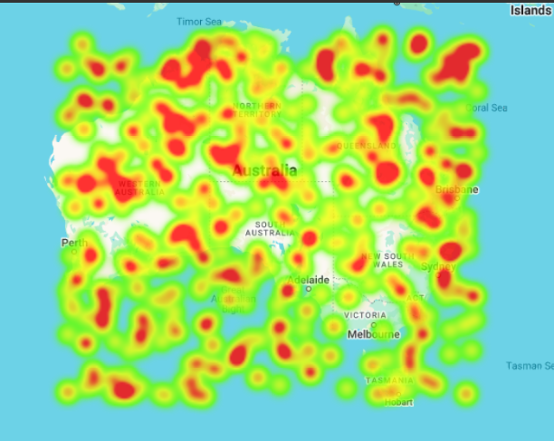

# Heatmap (`gm-heatmap`)

<br />

<div class="v3-gmaps-screenshot">
  
  <p>The Heatmap is a great way to show fuzzy data in a colorful way.</p>
</div>

## Simple Use ([demo](https://vue-bujcvu.stackblitz.io/heatmap))

```html
<template>
  <div style="height: 500px">
    <gm-map>
      <gm-heatmap :items="items" :radius="20" :opacity="0.8" />
    </gm-map>
  </div>
</template>

<script setup lang="ts">
import { gmMap, gmHeatmap, type GmWeightedPosition } from 'v3-gmaps';

const items: GmWeightedPosition[] = [
  { lat: 37, lng: 56, weight: 3 },
  { lat: 15, lng: 108, weight: 1 },
  // ...more items
];
</script>
```

## Props

| Props        |          Type          | Default | Description                                                   |
| :----------- | :--------------------: | :-----: | :------------------------------------------------------------ |
| items        | `GmWeightedPosition[]` |    -    | Sets the Heatmap data points.                                 |
| radius       |        `number`        |    -    | The radius of influence for each data point, in pixels.       |
| opacity      |        `number`        |    -    | The opacity of the heatmap, from 0 to 1.                      |
| gradient     |       `string[]`       |    -    | The color gradient of the heatmap, as an array of CSS colors. |
| dissipating  |       `boolean`        | `true`  | Whether heatmap dissipates on zoom.                           |
| maxIntensity |        `number`        |    -    | The maximum intensity of the heatmap.                         |

## Events

| Event     |                   Type                   | Description                                                                |
| :-------- | :--------------------------------------: | :------------------------------------------------------------------------- |
| mounted   | `google.maps.visualization.HeatmapLayer` | On mounted the component will emit the Google Maps object it represents.   |
| unmounted | `google.maps.visualization.HeatmapLayer` | On unmounted the component will emit the Google Maps object it represents. |

## Notes

- While regular position objects (`{ lat, lng }`) can be used, the Heatmap can also use weighted points: `{ lat, lng, weight }` which can add an extra dimension to your data.
- The gradient colors array should start with transparent for the lowest intensity and end with your highest intensity color.
