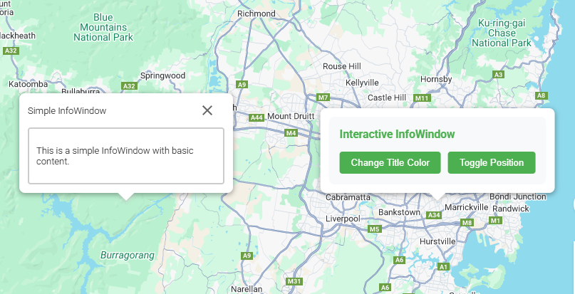

# Info Window (`gm-info-window`)

<div class="v3-gmaps-screenshot">
  
  <p>The Info Window is a really simple way to display some custom HTML on the map.</p>
</div>

### Simple Use ([demo](https://vue-bujcvu.stackblitz.io/info-window))

```html
<template>
  <div style="height: 500px">
    <gm-map>
      <gm-info-window 
        :position="{ lat: -33.9, lng: 151.1 }" 
        header-content="Simple InfoWindow">
        <div class="info-content">
          <p>Any HTML can go here.</p>
        </div>
      </gm-info-window>
    </gm-map>
  </div>
</template>

<script setup lang="ts">
import { gmMap, gmInfoWindow } from 'v3-gmaps';
</script>
```

### Props

| Props          |              Type               | Default | Description                                                 |
| :------------- | :-----------------------------: | :-----: | :---------------------------------------------------------- |
| options\*      | `google.maps.InfoWindowOptions` |  `{}`   | Object used to define the properties of a `gm-info-window`. |
| position       |          `GmPosition`           |    -    | Sets the info window position.                              |
| content        | `string \| HTMLElement \| Text` |    -    | Content to display in the InfoWindow.                       |
| disableAutoPan |            `boolean`            |    -    | Whether auto-panning is disabled when the InfoWindow opens. |
| headerContent  |            `string`             |    -    | Text to display in the InfoWindow header.                   |
| headerDisabled |            `boolean`            |    -    | Whether to disable the InfoWindow header completely.        |
| maxWidth       |            `number`             |    -    | Maximum width of the InfoWindow in pixels.                  |
| minWidth       |            `number`             |    -    | Minimum width of the InfoWindow in pixels.                  |
| zIndex         |            `number`             |    -    | Vertical layer to use for this component.                   |

\* To see all of the possible options, have a look at the [Google Maps InfoWindowOptions interface](https://developers.google.com/maps/documentation/javascript/reference/info-window#InfoWindowOptions).

### Methods

When using a ref on the `gm-info-window` component, you can access these methods:

| Method           | Description                                                                                  |
| :--------------- | :------------------------------------------------------------------------------------------- |
| `open(options?)` | Opens the InfoWindow. Accepts optional options including `map`, `anchor`, and `shouldFocus`. |
| `close()`        | Closes the InfoWindow.                                                                       |
| `isOpen()`       | Returns whether the InfoWindow is currently open.                                            |

### Events

| Event            |              Type               | Description                                                                                       |
| :--------------- | :-----------------------------: | :------------------------------------------------------------------------------------------------ |
| closeclick       |                -                | This event is fired when the close button was clicked.                                            |
| content_changed  | `string \| HTMLElement \| Text` | This event is fired when the content property changes.                                            |
| domready         |          `HTMLElement`          | This event is fired when the &lt;div> containing the InfoWindow's content is attached to the DOM. |
| mounted          |    `google.maps.InfoWindow`     | On mounted the component will emit its Google Maps object.                                        |
| position_changed |      `GmPosition \| null`       | This event is fired when the position property changes.                                           |
| unmounted        |    `google.maps.InfoWindow`     | On unmounted the component will emit its Google Maps object.                                      |
| zindex_changed   |        `number \| null`         | This event is fired when the InfoWindow's zIndex changes.                                         |

### Notes

- `gm-info-window` is based on the [Google Maps InfoWindow](https://developers.google.com/maps/documentation/javascript/reference/info-window).
- You can provide custom content using the default slot for complete flexibility with your InfoWindow content.
- The `headerContent` prop provides an easy way to add a title to your InfoWindow, while `headerDisabled` allows you to remove the header section entirely.
- The slot provides access to `close` and `open` methods through scoped slots if you need them: `<template #default="{ close, open }">`.
