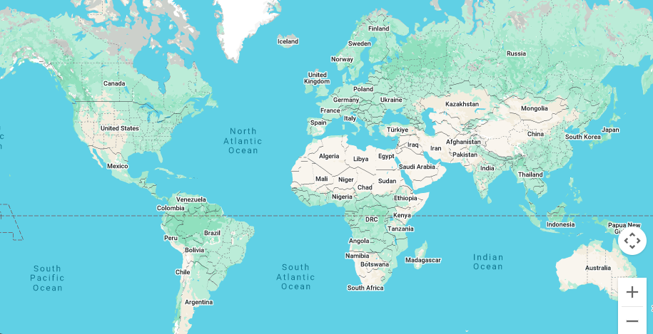

# Map (`gmaps-map`)

<div class="v3-gmaps-screenshot">
  
  <p>The Map is the core component of the library (and Google Maps). All the other components are created by placing them inside the Map component.</p>
</div>

### Simple Use ([demo](https://vue-bujcvu.stackblitz.io/map))

```html
<template>
  <div style="height: 500px">
    <gmaps-map />
  </div>
</template>

<script>
import { defineComponent } from 'vue';
import { gmapsMap } from 'v3-gmaps';

export default defineComponent({
  components: { gmapsMap },
});
</script>
```

### Props

| Props          |       Type        |  Default  | Description                                                                                 |
| :------------- | :---------------: | :-------: | :------------------------------------------------------------------------------------------ |
| options\*      | `GmapsMapOptions` |     -     | Object used to define the properties of a `gmaps-map`.                                      |
| center         |  `GmapsPosition`  |     -     | The initial Map center.                                                                     |
| clickableIcons |     `boolean`     |  `true`   | Whether map points of interest are clickable.                                               |
| heading        |     `number`      |     -     | The heading for aerial imagery in degrees measured clockwise from cardinal direction North. |
| mapTypeId      | `GmapsMapTypeId`  | `ROADMAP` | The initial Map mapTypeId.                                                                  |
| tilt           |     `number`      |     -     | Sets the angle of incidence of the map.                                                     |
| zoom           |     `number`      |     -     | The initial Map zoom level.                                                                 |
| throttle       |     `number`      |   `100`   | The event throttle value in milliseconds.                                                   |

\* To see all of the possible options, have a look at the [Google Maps MapOptions interface](https://developers.google.com/maps/documentation/javascript/reference/map#MapOptions).

### Events

| Event                           |       Type        | Description                                                                                    |
| :------------------------------ | :---------------: | :--------------------------------------------------------------------------------------------- |
| bounds_changed                  |   `GmapsBounds`   | This event is fired when the viewport bounds have changed.                                     |
| center_changed                  |  `GmapsPosition`  | This event is fired when the map center property changes.                                      |
| click                           |  `GmapsPosition`  | This event is fired when the user clicks on the map.                                           |
| contextmenu                     |  `GmapsPosition`  | This event is fired when the DOM contextmenu event is fired on the map container.              |
| dblclick                        |  `GmapsPosition`  | This event is fired when the user double-clicks on the map.                                    |
| drag                            |         -         | This event is repeatedly fired while the user drags the map.                                   |
| dragend                         |         -         | This event is fired when the user stops dragging the map.                                      |
| dragstart                       |         -         | This event is fired when the user starts dragging the map.                                     |
| error\*                         |     `string`      | Special event if a the Map encountered an error. It returns the error message if there is one. |
| heading_changed                 |     `number`      | This event is fired when the map heading property changes.                                     |
| idle                            |         -         | This event is fired when the map becomes idle after panning or zooming.                        |
| isfractionalzoomenabled_changed |     `number`      | This event is fired when the isFractionalZoomEnabled property has changed.                     |
| maptypeid_changed               | `GmapsMapTypeId`  | This event is fired when the mapTypeId property changes.                                       |
| mounted                         | `google.maps.Map` | On mounted the component will emit the Google Maps object it represents.                       |
| mousemove                       |  `GmapsPosition`  | This event is fired whenever the user's mouse moves over the map container.                    |
| mouseout                        |  `GmapsPosition`  | This event is fired when the user's mouse exits the map container.                             |
| mouseover                       |  `GmapsPosition`  | This event is fired when the user's mouse enters the map container.                            |
| projection_changed              |         -         | This event is fired when the projection has changed.                                           |
| renderingtype_changed           |         -         | This event is fired when the renderingType has changed.                                        |
| rightclick                      |  `GmapsPosition`  | This event is fired when the user right-clicks on the map.                                     |
| tilesloaded                     |         -         | This event is fired when the visible tiles have finished loading.                              |
| tilt_changed                    |     `number`      | This event is fired when the map tilt property changes.                                        |
| unmounted                       | `google.maps.Map` | On unmounted the component will emit the Google Maps object it represents.                     |
| zoom_changed                    |     `number`      | This event is fired when the map zoom property changes.                                        |

### Notes

- `gmaps-map` has most of the [properties and events Google Maps' Map](https://developers.google.com/maps/documentation/javascript/reference/map) has.
- The element that contains `<gmaps-map />` should have a `height` and `width` style defined so that it can grow into it. *If you can't see the map, that may be your problem*.
- Double clicking will result in both `click` and `dblclick` events firing (in that order).
- The `contextmenu` even should be used instead of `rightclick` as it will accommodate Mac and mobile devices' methods of right clicking too.
- To make demo's and tests simpler, a default object  `zoom` is defaulted to `2` and `center` is defaulted to `{ lat: 0, lng: 0 }` to simplify demo's and tests.
- `gmaps-map` `error` event does not capture Google Maps errors - only those coming from Vue and/or the implementation. Things like invalid referrer errors are not able to be captured through this event.

