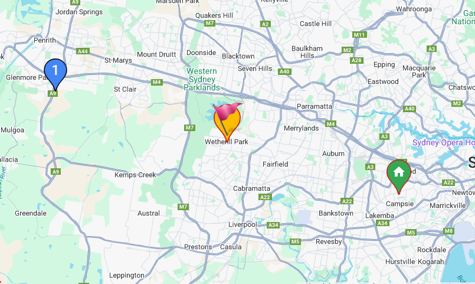

## Marker (`gmaps-marker`)

<div class="v3-gmaps-screenshot">
  
  <p>The Marker is the most used component of the library (and Google Maps).</p>
</div>

::: tip
`gmaps-marker` has most of the [properties and events Google Maps' Marker](https://developers.google.com/maps/documentation/javascript/reference/marker) has.
:::

### Simple Use ([demo](https://vue-bujcvu.stackblitz.io/marker))

```html
<template>
  <div style="height: 500px">
    <gmaps-map>
      <gmaps-marker :position="{ lat: 0, lng: 0 }" />
    </gmaps-map>
  </div>
</template>

<script>
import { defineComponent } from 'vue';
import { gmapsMap, gmapsMarker } from 'v3-gmaps';

export default defineComponent({
  components: { gmapsMap, gmapsMarker },
});
</script>
```

### Props (all optional)

| Props     |         Type          |  Default  | Description                                               |
| :-------- | :-------------------: | :-------: | :-------------------------------------------------------- |
| options\* | `GmapsMarkerOptions`  | See below | Object used to define the properties of a `gmaps-marker`. |
| animation | `'BOUNCE' \| 'DROP'`  |     -     | Which animation to play when marker is added to a map.    |
| clickable |       `boolean`       |  `true`   | Whether the marker receives mouse and touch events.       |
| cursor    |       `string`        |     -     | Mouse cursor type to show on hover.                       |
| draggable |       `boolean`       |  `false`  | Whether the marker can be dragged.                        |
| icon      | `string \| GmapsIcon` |     -     | Icon for the foreground.                                  |
| label     |  `GmapsMarkerLabel`   |     -     | Adds a label to the marker.                               |
| opacity   |       `number`        |     -     | A number between `0.0` (transparent) and `1.0` (opaque).  |
| position  |    `GmapsPosition`    |     -     | Sets the marker position.                                 |
| shape     |  `GmapsMarkerShape`   |     -     | Image map region definition used for drag/click.          |
| title     |       `string`        |     -     | Rollover text.                                            |
| visible   |       `boolean`       |     -     | Whether the marker is visible.                            |
| zIndex    |       `number`        |     -     | Vertical layer to use for this marker.                    |

\* To see all of the possible options, have a look at the [Google Maps MarkerOptions interface](https://developers.google.com/maps/documentation/javascript/reference/map#MarkerOptions).

### Events

| Event             |      Type       | Description                                                                |
| :---------------- | :-------------: | :------------------------------------------------------------------------- |
| animation_changed |        -        | This event is fired when the Marker animation property changes.            |
| click             | `GmapsPosition` | This event is fired when the Marker icon was clicked.                      |
| clickable_changed |    `boolean`    | This event is fired when the Marker clickable property changes.            |
| contextmenu       | `GmapsPosition` | This event is fired when the DOM contextmenu event is fired on the Marker. |
| cursor_changed    |    `string`     | This event is fired when the Marker cursor property changes.               |
| dblclick          | `GmapsPosition` | This event is fired when the Marker icon was double clicked.               |
| drag              | `GmapsPosition` | This event is repeatedly fired while the user drags the Marker.            |
| dragend           | `GmapsPosition` | This event is fired when the user stops dragging the Marker.               |
| draggable_changed |    `boolean`    | This event is fired when the Marker draggable property changes.            |
| dragstart         | `GmapsPosition` | This event is fired when the user starts dragging the Marker.              |
| flat_changed      |        -        | This event is fired when the Marker flat property changes.                 |
| icon_changed      |        -        | This event is fired when the Marker icon property changes.                 |
| mousedown         | `GmapsPosition` | This event is fired for a mousedown on the Marker.                         |
| mouseout          | `GmapsPosition` | This event is fired when the mouse leaves the area of the Marker icon.     |
| mouseover         | `GmapsPosition` | This event is fired when the mouse enters the area of the Marker icon.     |
| mouseup           | `GmapsPosition` | This event is fired for a mouseup on the Marker.                           |
| position_changed  | `GmapsPosition` | This event is fired when the Marker position property changes.             |
| rightclick        | `GmapsPosition` | This event is fired for a rightclick on the Marker.                        |
| shape_changed     |        -        | This event is fired when the Marker shape property changes.                |
| title_changed     |    `string`     | This event is fired when the Marker title property changes.                |
| visible_changed   |    `boolean`    | This event is fired when the Marker visible property changes.              |
| zindex_changed    |    `number`     | This event is fired when the Marker zIndex property changes.               |

<!-- ### Notes -->
