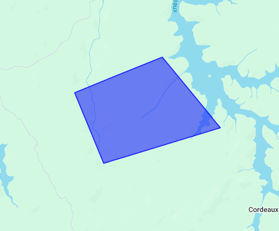

# Polygon (`gmaps-polygon`)

<div class="v3-gmaps-screenshot">
  
  <p>In addition to <a href="./rectangle">rectangles</a>, <a href="./polyline">polylines</a>, and <a href="./circle">circles</a> you can also create polygons on a map.</p>
</div>

### Simple Use ([demo](https://vue-bujcvu.stackblitz.io/polylines))

```html
<template>
  <div style="height: 500px">
    <gmaps-map>
      <gmaps-polygon :paths="[[{ lat: -28, lng: 125 }, { lat: -25, lng: 130 }, { lat: -32, lng: 120 }]]" />
    </gmaps-map>
  </div>
</template>

<script>
import { defineComponent } from 'vue';
import { gmapsMap, gmapsPolygon } from 'v3-gmaps';

export default defineComponent({
  components: { gmapsMap, gmapsPolygon },
});
</script>
```

### Props

| Props     |                  Type                  | Default | Description                                                                                                        |
| :-------- | :------------------------------------: | :-----: | :----------------------------------------------------------------------------------------------------------------- |
| options\* |         `GmapsPolygonOptions`          |    -    | Object used to define the properties of a `gmaps-polygon`.                                                         |
| draggable |               `boolean`                | `false` | Whether this Circle can be dragged over the map.                                                                   |
| editable  |               `boolean`                | `false` | Whether this Circle can be edited by dragging the control points shown at the center and around the circumference. |
| paths     | `GmapsPosition[] \| GmapsPosition[][]` |    -    | The ordered sequence of coordinates that designates a closed loop.                                                 |
| visible   |               `boolean`                | `true`  | Whether this Circle is visible on the map.                                                                         |

\* To see all of the possible options, have a look at the [Google Maps PolygonOptions interface](https://developers.google.com/maps/documentation/javascript/reference/polygon#PolygonOptions).

### Events

| Event        |         Type          | Description                                                                 |
| :----------- | :-------------------: | :-------------------------------------------------------------------------- |
| click        |    `GmapsPosition`    | This event is fired when the DOM click event is fired on the Polygon.       |
| contextmenu  |    `GmapsPosition`    | This event is fired when the DOM contextmenu event is fired on the Polygon. |
| dblclick     |    `GmapsPosition`    | This event is fired when the DOM dblclick event is fired on the Polygon.    |
| drag         |    `GmapsPosition`    | This event is repeatedly fired while the user drags the Polygon.            |
| dragend      |    `GmapsPosition`    | This event is fired when the user stops dragging the Polygon.               |
| dragstart    |    `GmapsPosition`    | This event is fired when the user starts dragging the Polygon.              |
| mounted      | `google.maps.Polygon` | On mounted the component will emit the Google Maps object it represents.    |
| mousedown    |    `GmapsPosition`    | This event is fired for a mousedown on the Polygon.                         |
| mousemove    |    `GmapsPosition`    | This event is fired for a mousemove on the Polygon.                         |
| mouseout     |    `GmapsPosition`    | This event is fired for a mouseout on the Polygone.                         |
| mouseover    |    `GmapsPosition`    | This event is fired for a mouseover on the Polygon.                         |
| mouseup      |    `GmapsPosition`    | This event is fired for a mouseup on the Polygon.                           |
| path_changed |  `GmapsPosition[][]`  | This event is fired when any of the Polygon's paths are changed.            |
| rightclick   |    `GmapsPosition`    | This event is fired for a rightclick on the Polygon.                        |
| unmounted    | `google.maps.Polygon` | On unmounted the component will emit the Google Maps object it represents.  |

### Notes

- `gmaps-polygon` has most of the [properties and events Google Maps' Polygon](https://developers.google.com/maps/documentation/javascript/reference/polygon#Polygon) has.
- Unlike polylines, a polygon may consist of one or more paths. As a result, the paths property may specify one or more arrays of LatLng (`GmapsPosition`) coordinates.
- If you define the coordinates clockwise, the polygon will be shaded in. If you define the coordinates anti-clockwise, the polygone will remove shading. An example of this can be seen the in the [Polylines 2 demo](https://stackblitz.com/edit/vue-bujcvu?file=src%2Fcomponents%2FPolylines2.vue).
