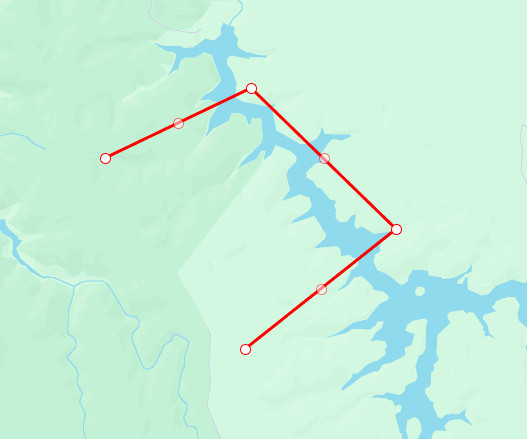

# Polyline (`gm-polyline`)

<div class="v3-gmaps-screenshot">
  
  <p>In addition to <a href="./rectangle">rectangles</a>, <a href="./polygon">polygons</a>, and <a href="./circle">circles</a> you can also create polylines on a map.</p>
</div>

### Simple Use ([demo](https://vue-bujcvu.stackblitz.io/polylines))

```html
<template>
  <div style="height: 500px">
    <gm-map>
      <gm-polyline :path="[{ lat: -28, lng: 125 }, { lat: -25, lng: 130 }, { lat: -32, lng: 120 }]" />
    </gm-map>
  </div>
</template>

<script setup lang="ts">
import { gmMap, gmPolyline } from 'v3-gmaps';
</script>
```

### Props

| Props     |        Type         | Default | Description                                                                                                |
| :-------- | :-----------------: | :-----: | :--------------------------------------------------------------------------------------------------------- |
| options\* | `GmPolylineOptions` |    -    | Object used to define the properties of a `gm-polyline`.                                                   |
| draggable |      `boolean`      | `false` | Whether this Polyline can be dragged over the map.                                                         |
| editable  |      `boolean`      | `false` | Whether this Polyline can be edited by dragging the control points shown at the vertices and on each edge. |
| path      |   `GmPosition[]`    |    -    | The ordered sequence of coordinates of the Polyline.                                                       |
| visible   |      `boolean`      | `true`  | Whether this Polyline is visible on the map.                                                               |

\* To see all of the possible options, have a look at the [Google Maps PolylineOptions interface](https://developers.google.com/maps/documentation/javascript/reference/polygon#PolylineOptions).

### Events

| Event        |          Type          | Description                                                                  |
| :----------- | :--------------------: | :--------------------------------------------------------------------------- |
| click        |      `GmPosition`      | This event is fired when the DOM click event is fired on the Polyline.       |
| contextmenu  |      `GmPosition`      | This event is fired when the DOM contextmenu event is fired on the Polyline. |
| dblclick     |      `GmPosition`      | This event is fired when the DOM dblclick event is fired on the Polyline.    |
| drag         |      `GmPosition`      | This event is repeatedly fired while the user drags the Polyline.            |
| dragend      |      `GmPosition`      | This event is fired when the user stops dragging the Polyline.               |
| dragstart    |      `GmPosition`      | This event is fired when the user starts dragging the Polyline.              |
| mounted      | `google.maps.Polyline` | On mounted the component will emit the Google Maps object it represents.     |
| mousedown    |      `GmPosition`      | This event is fired for a mousedown on the Polyline.                         |
| mousemove    |      `GmPosition`      | This event is fired for a mousemove on the Polyline.                         |
| mouseout     |      `GmPosition`      | This event is fired for a mouseout on the Polyline.                          |
| mouseover    |      `GmPosition`      | This event is fired for a mouseover on the Polyline.                         |
| mouseup      |      `GmPosition`      | This event is fired for a mouseup on the Polyline.                           |
| path_changed |     `GmPosition[]`     | This event is fired when the Polyline's path is changed.                     |
| rightclick   |      `GmPosition`      | This event is fired for a rightclick on the Polyline.                        |
| unmounted    | `google.maps.Polyline` | On unmounted the component will emit the Google Maps object it represents.   |

### Notes

- `gm-polyline` is based on the [Google Maps Polyline interface](https://developers.google.com/maps/documentation/javascript/reference/polygon#Polyline).
