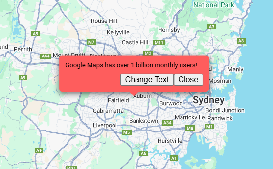

# Popup (`gmaps-popup`)

<div class="v3-gmaps-screenshot">
  
  <p>The Popup is a basically a borderless Info Window with no close button.</p>
</div>

### Simple Use ([demo](https://vue-bujcvu.stackblitz.io/popup))

```html
<template>
  <div style="height: 500px">
    <gmaps-map>
      <gmaps-popup>
        <p>Any HTML can go here.</p>
      </gmaps-popup>
    </gmaps-map>
  </div>
</template>

<script>
import { defineComponent } from 'vue';
import { gmapsMap, gmapsPopup } from 'v3-gmaps';

export default defineComponent({
  components: { gmapsMap, gmapsPopup },
});
</script>
```

### Props

| Props      |      Type       | Default | Description                       |
| :--------- | :-------------: | :-----: | :-------------------------------- |
| background |    `string`     | #EEEEEE | Background CSS to use,            |
| width      |    `string`     |  200px  | Popup width.                      |
| height     |    `string`     |  200px  | Popup height.                     |
| position\* | `GmapsPosition` |    -    | Position of the Popup on the map. |

\* A position is required.

### Events

| Event       |           Type            | Description                                                                |
| :---------- | :-----------------------: | :------------------------------------------------------------------------- |
| click       |             -             | This event is fired when the DOM click event is fired on the Popup.        |
| contextmenu |             -             | This event is fired when the DOM contextmenu event is fired on the Popup.  |
| dblclick    |             -             | This event is fired when the DOM dblclick event is fired on the Popup.     |
| mounted     | `google.maps.OverlayView` | On mounted the component will emit the Google Maps object it represents.   |
| unmounted   | `google.maps.OverlayView` | On unmounted the component will emit the Google Maps object it represents. |

### Notes

- This is a custom component and not available using only the Google Maps API.
- It was largely made using the [Custom Overlay Sample](https://developers.google.com/maps/documentation/javascript/examples/overlay-popup) provided by Google.
