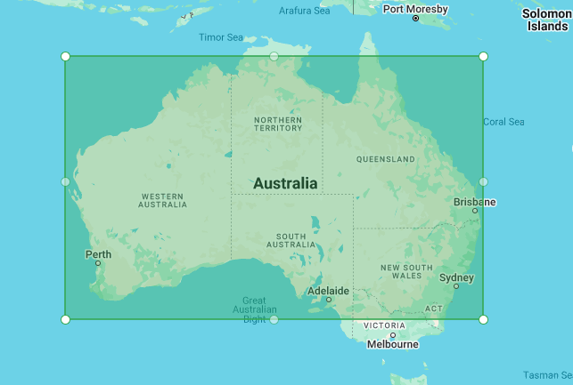

# Rectangle (`gm-rectangle`)

<br />

<div class="v3-gmaps-screenshot">
  
  <p>In addition to <a href="./polyline">polylines</a>, <a href="./polygon">polygons</a>, and <a href="./circle">circles</a> you can also create rectangles on a map.</p>
</div>

## Simple Use ([demo](https://vue-bujcvu.stackblitz.io/shapes))

```html
<template>
  <div style="height: 500px">
    <gm-map>
      <gm-rectangle :bounds="{ east: 145, north: -20, west: 132, south: -27 }" />
    </gm-map>
  </div>
</template>

<script setup lang="ts">
import { gmMap, gmRectangle } from 'v3-gmaps';
</script>
```


## Props

| Props     |              Type              | Default | Description                                                                                                                              |
| :-------- | :----------------------------: | :-----: | :--------------------------------------------------------------------------------------------------------------------------------------- |
| bounds    |           `GmBounds`           |    -    | The bounds.                                                                                                                              |
| draggable |           `boolean`            | `false` | Whether this Rectangle can be dragged over the map.                                                                                      |
| editable  |           `boolean`            | `false` | Whether this Rectangle can be edited by dragging the control points shown at the corners and on each edge.                               |
| visible   |           `boolean`            | `true`  | Whether this rectangle is visible on the map.                                                                                            |
| options   | `google.maps.RectangleOptions` |    -    | [Google Maps RectangleOptions interface](https://developers.google.com/maps/documentation/javascript/reference/polygon#RectangleOptions) |

## Events

| Event          |          Type           | Description                                                                   |
| :------------- | :---------------------: | :---------------------------------------------------------------------------- |
| bounds_changed |       `GmBounds`        | This event is fired when the rectangle's bounds are changed.                  |
| click          |      `GmPosition`       | This event is fired when the DOM click event is fired on the rectangle.       |
| contextmenu    |      `GmPosition`       | This event is fired when the DOM contextmenu event is fired on the rectangle. |
| dblclick       |      `GmPosition`       | This event is fired when the DOM dblclick event is fired on the rectangle.    |
| drag           |      `GmPosition`       | This event is repeatedly fired while the user drags the Rectangle.            |
| dragend        |      `GmPosition`       | This event is fired when the user stops dragging the Rectangle.               |
| dragstart      |      `GmPosition`       | This event is fired when the user starts dragging the Rectangle.              |
| mounted        | `google.maps.Rectangle` | On mounted the component will emit the Google Maps object it represents.      |
| mousedown      |      `GmPosition`       | This event is fired for a mousedown on the Rectangle.                         |
| mousemove      |      `GmPosition`       | This event is fired for a mousemove on the Rectangle.                         |
| mouseout       |      `GmPosition`       | This event is fired when the mouse leaves the area of the Rectangle.          |
| mouseover      |      `GmPosition`       | This event is fired when the mouse enters the area of the Rectangle.          |
| mouseup        |      `GmPosition`       | This event is fired for a mouseup on the Rectangle.                           |
| rightclick     |      `GmPosition`       | This event is fired for a rightclick on the Rectangle.                        |
| unmounted      | `google.maps.Rectangle` | On unmounted the component will emit the Google Maps object it represents.    |
