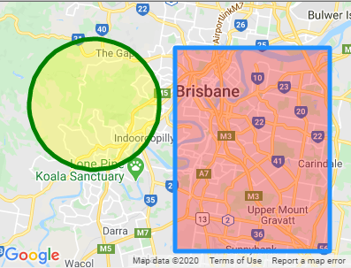

<div class="v3-gmaps-screenshot">
  
  <p>In addition to <a href="./polylines.md">polygons</a>, you can also create circles and rectangles on a map.</p>
</div>

### Simple Use ([demo](https://vue-bujcvu.stackblitz.io/shapes))

```html
<template>
  <div style="height: 500px">
    <gmaps-map>
      <gmaps-marker :position="{ lat: 0, lng: 0 }" />
    </gmaps-map>
  </div>
</template>

<script>
import { defineComponent } from 'vue';
import { gmapsMap, gmapsMarker } from 'v3-gmaps';

export default defineComponent({
  components: { gmapsMap, gmapsMarker },
});
</script>
```

## Rectangle (`gmaps-rectangle`)

::: tip
`gmaps-rectangle` has most of the [properties and events Google Maps' Rectangle](https://developers.google.com/maps/documentation/javascript/reference/polygon#Rectangle) has.
:::

### Props (all optional)

| Props     |          Type           | Default | Description                                                                                                 |
| :-------- | :---------------------: | :-----: | :---------------------------------------------------------------------------------------------------------- |
| options\* | `GmapsRectangleOptions` |    -    | Object used to define the properties of a `gmaps-rectangle`.                                                |
| bounds    |     `'GmapsBounds`      |    -    | The bounds.                                                                                                 |
| draggable |        `boolean`        | `false` | Whether this Rectangle handles mouse events.                                                                |
| editable  |        `boolean`        | `false` | Whether this Rectangle can be resized by dragging the control points shown at the corners and on each edge. |
| visible   |        `boolean`        | `true`  | Whether this rectangle is visible on the map.                                                               |

\* To see all of the possible options, have a look at the [Google Maps MarkerOptions interface](https://developers.google.com/maps/documentation/javascript/reference/map#MarkerOptions).

### Events

| Event          |      Type       | Description                                                                   |
| :------------- | :-------------: | :---------------------------------------------------------------------------- |
| bounds_changed |  `GmapsBounds`  | This event is fired when the rectangle's bounds are changed.                  |
| click          | `GmapsPosition` | This event is fired when the DOM click event is fired on the rectangle.       |
| contextmenu    | `GmapsPosition` | This event is fired when the DOM contextmenu event is fired on the rectangle. |
| dblclick       | `GmapsPosition` | This event is fired when the DOM dblclick event is fired on the rectangle.    |
| drag           | `GmapsPosition` | This event is repeatedly fired while the user drags the Rectangle.            |
| dragend        | `GmapsPosition` | This event is fired when the user stops dragging the Rectangle.               |
| dragstart      | `GmapsPosition` | This event is fired when the user starts dragging the Rectangle.              |
| mousedown      | `GmapsPosition` | This event is fired for a mousedown on the Rectangle.                         |
| mousemove      | `GmapsPosition` | This event is fired for a mousedown on the Rectangle.                         |
| mouseout       | `GmapsPosition` | This event is fired when the mouse leaves the area of the Rectangle.          |
| mouseover      | `GmapsPosition` | This event is fired when the mouse enters the area of the Rectangle.          |
| mouseup        | `GmapsPosition` | This event is fired for a mouseup on the Rectangle.                           |
| rightclick     | `GmapsPosition` | This event is fired for a rightclick on the Rectangle.                        |

<!-- ### Notes -->
